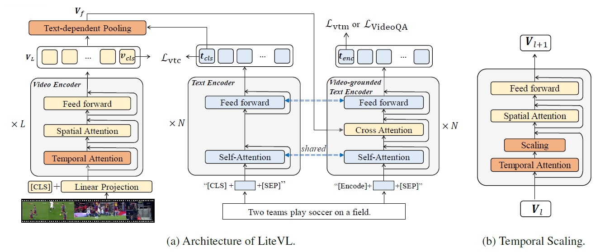

# LiteVL (EMNLP 22')
## LiteVL: Efficient Video-Language Learning with Enhanced Spatial-Temporal Modeling [[Paper]](https://arxiv.org/abs/2210.11929)
#### Dongsheng Chen, Chaofan Tao, Lu Hou, Lifeng Shang, Xin Jiang, Qun Liu

MindSpore Code for LiteVL (Coming soon).

